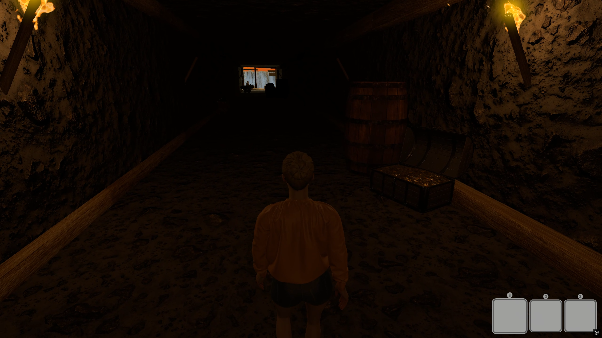

# Stranded - The Pirate Isle

A game focused on exploration and environmental interaction, where the player must find their way through 2 distinct levels to reach the end of the journey.

This was my **introductory project to the Unity engine**, developed for the **Virtual Environment Animation (AAV)** course. The main goal was to apply and integrate various technical and visual concepts taught during the semester into a single playable experience.

## 🎮 About the Game

The game consists of two sequential stages (levels). To advance, the player needs to explore the scenarios and interact directly with environmental elements and the NPCs (Non-Playable Characters) present in the world.

### ✨ Key Features and Learnings
* **Interaction & Mechanics:** Environmental object interaction system for level progression.
* **NPC Systems:** Implementation of non-playable characters to guide the narrative or interact with the player.
* **Lighting:** Use of mixed lighting techniques, combining pre-calculated lights (*Baked Lighting*) for performance optimization with dynamic lights (*Realtime Lighting*).
* **Audio:** Integration of sound effects and background music to complement the atmosphere of the levels.

## 🎨 Visual Design and UI

The entire visual identity of the game's interface was designed externally using **Canva**. This includes:
* HUD elements.
* Lobby screen.
* The full end-credits video.

## ⚙️ Controls (Example - Adapt to your actual controls)

* **W, A, S, D** - Character movement.
* **Mouse** - Camera rotation.
* **E** - Interact with the environment and NPCs.
* **SPACE** - Jump.

## 🚀 How to Play / Run the Project

1. Download the build here: [Download](https://drive.google.com/drive/folders/1aKVYSPIYQOOdfcPfDBix0OJYK_M9hRq3?usp=sharing)

## 📸 Visual Demonstration

|  |  |  |

|  |  |  |

---
*Academic project developed by: Rafael Lemos - Institution: Instituto Superior de Engenharia de Lisboa*
